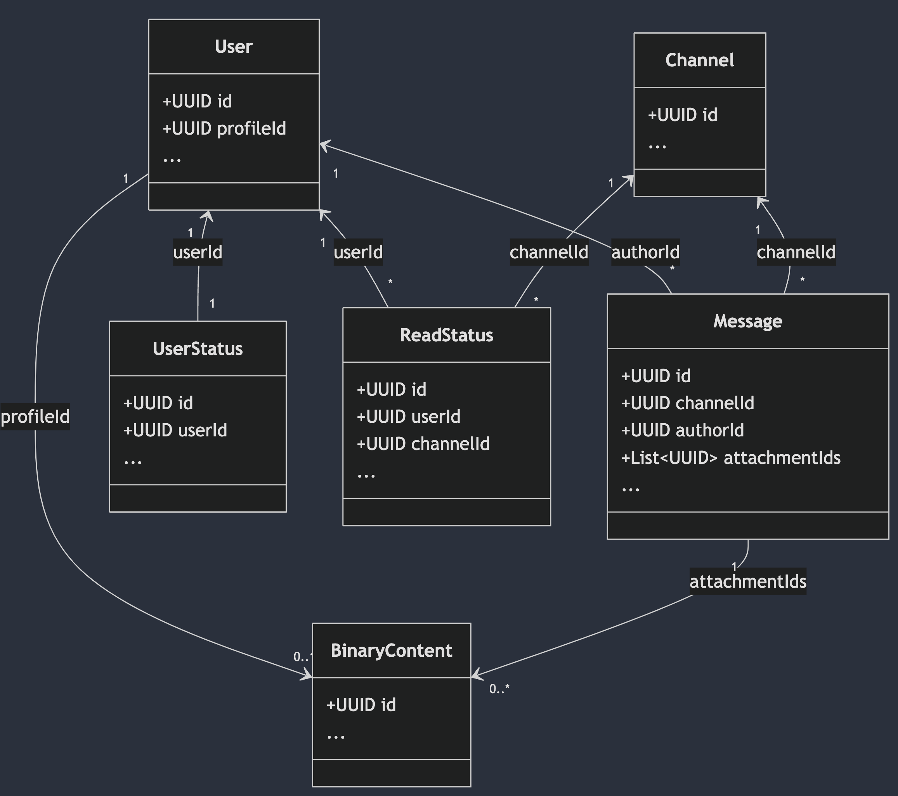
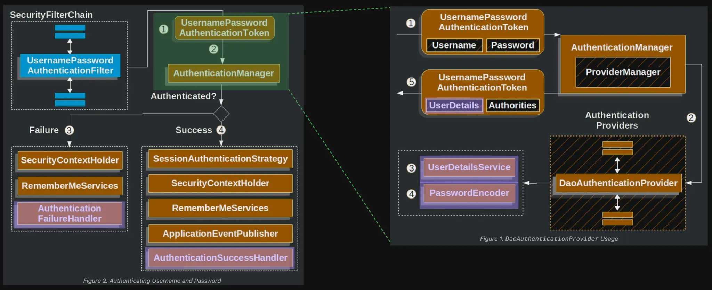
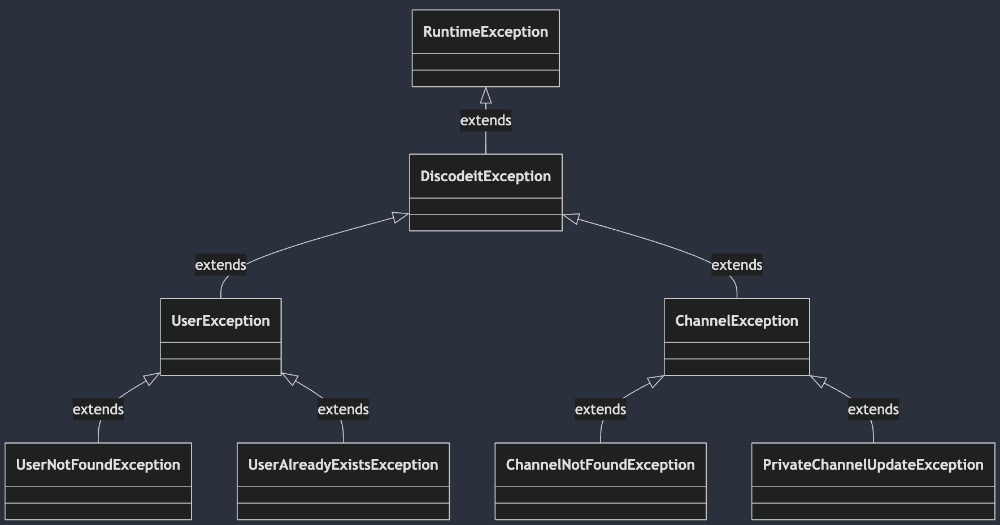
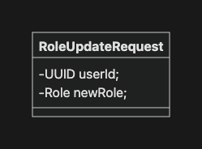
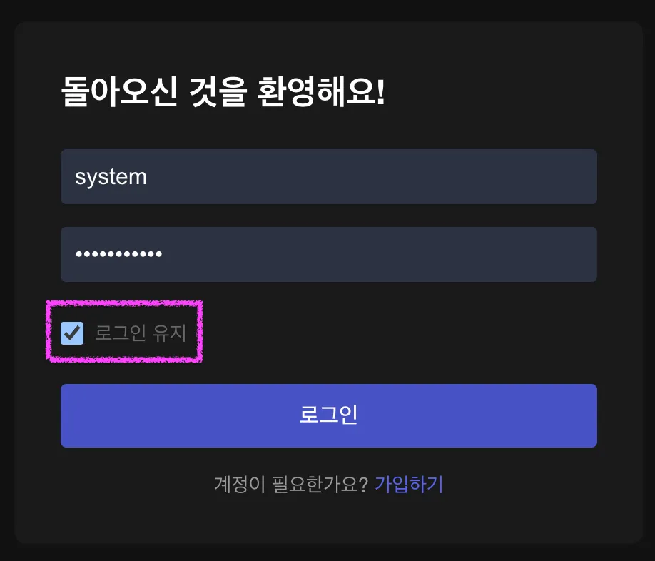
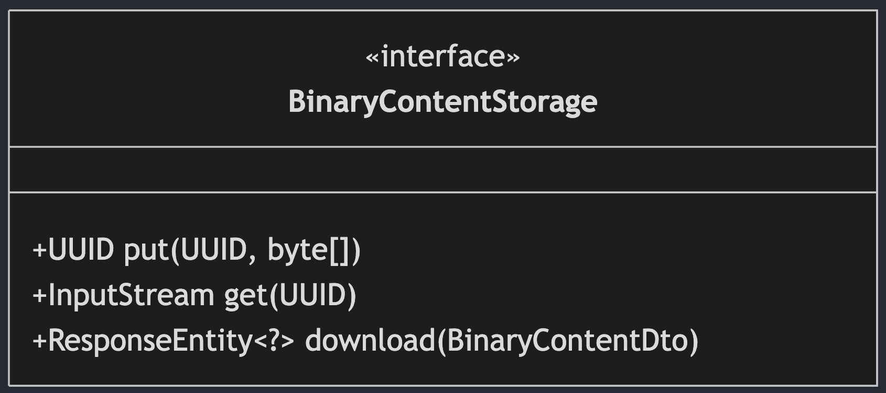
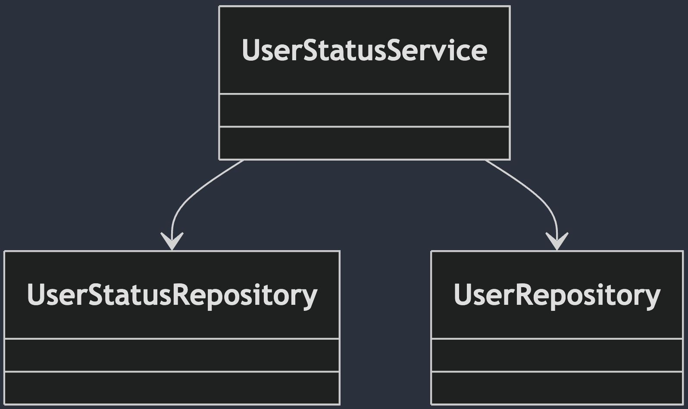

# 프로젝트 마일스톤

- 로그 관리
- 커스텀 예외 설계
- 유효성 검사
- Actuator를 활용한 모니터링
- 단위 테스트
- 슬라이스 테스트
- 통합 테스트

# 기본 요구사항

## 프로파일 기반 설정 관리

- [x] 개발, 운영 환경에 대한 프로파일을 구성하세요.
    - [x] `application-dev.yaml`, `application-prod.yaml` 파일을 생성하세요.
    - [x] 다음과 같은 설정값을 프로파일별로 분리하세요.
        - [x] 데이터베이스 연결 정보
        - [x] 서버 포트

## 로그 관리

- [x] Lombok의 `@Slf4j` 어노테이션을 활용해 로깅을 쉽게 추가할 수 있도록 구성하세요.
- [x] `application.yaml`에 기본 로깅 레벨을 설정하세요.
    - 기본적으로 `info` 레벨로 설정합니다.
- [x] 환경 별 적절한 로깅 레벨을 프로파일 별로 설정해보세요.
    - SQL 로그를 보기위해 설정했던 레벨은 유지합니다.
    - 우리가 작성한 프로젝트의 로그는 개발 환경에서 `debug`, 운영 환경에서는 `info` 레벨로 설정합니다.
- [ ] Spring Boot의 기본 로깅 구현체인 Logback의 설정 파일을 구성하세요.
    - [ ] `logback-spring.xml` 파일을 생성하세요.
    - [ ] 다음 예시와 같은 로그 메시지를 출력하기 위한 로깅 패턴과 출력 방식을 커스터마이징하세요.
        - 로그 출력 예시
            ```
            # 패턴
            {년}-{월}-{일} {시}:{분}:{초}:{밀리초} [{스레드명}] {로그 레벨(5글자로 맞춤)} {로거 이름(최대 36글자)} - {로그 메시지}{줄바꿈}

            # 예시
            25-01-01 10:33:55.740 [main] DEBUG c.s.m.discodeit.DiscodeitApplication - Running with Spring Boot v3.4.0, Spring v6.2.0
            ```
    - [ ] 콘솔과 파일에 동시에 로그를 기록하도록 설정하세요.
        - [ ] 파일은 `{프로젝트 루트}/.logs` 경로에 저장되도록 설정하세요.
    - [ ] 로그 파일은 일자별로 롤링되도록 구성하세요.
    - [ ] 로그 파일은 30일간 보관하도록 구성하세요.
- [ ] 서비스 레이어와 컨트롤러 레이어의 주요 메소드에 로깅을 추가하세요.
    - [ ] 로깅 레벨을 적절히 사용하세요: ERROR, WARN, INFO, DEBUG
    - [ ] 다음과 같은 메소드에 로깅을 추가하세요:
        - [ ] 사용자 생성/수정/삭제
        - [ ] 채널 생성/수정/삭제
        - [ ] 메시지 생성/수정/삭제
        - [ ] 파일 업로드/다운로드

## 예외 처리 고도화

- [ ] 커스텀 예외를 설계하고 구현하세요.
    - 패키지명: `com.sprint.mission.discodeit.exception[.{도메인}]`
    - [ ] `ErrorCode` Enum 클래스를 통해 예외 코드명과 메시지를 정의하세요.
        - 아래는 예시입니다. 필요하다고 판단되는 다양한 코드를 정의하세요.
        - 예시
          
    - [ ] 모든 예외의 기본이 되는 `DiscodeitException` 클래스를 정의하세요.
        - 클래스 다이어그램
          
        - `details`는 예외 발생 상황에 대한 추가정보를 저장하기 위한 속성입니다.
            - 예시
                - 조회 시도한 사용자의 ID 정보
                - 업데이트 시도한 PRIVATE 채널의 ID 정보
    - [ ] `DiscodeitException`을 상속하는 주요 도메인 별 메인 예외 클래스를 정의하세요.
        - `UserException`, `ChannelException` 등
        - 실제로 활용되는 클래스라기보다는 예외 클래스의 계층 구조를 명확하게 하기 위한 클래스 입니다.
    - [ ] 도메인 메인 예외 클래스를 상속하는 구체적인 예외 클래스를 정의하세요.
        - `UserNotFoundException`, `UserAlreadyExistException` 등 필요한 예외를 정의하세요.
        - 예시
          
- [ ] 기존에 구현했던 예외를 커스텀 예외로 대체하세요.
    - NoSuchElementException
    - IllegalArgumentException
    - …
- [ ] `ErrorResponse`를 통해 일관된 예외 응답을 정의하세요.
    - 클래스 다이어그램
      
    - `int status`: HTTP 상태코드
    - `String exceptionType`: 발생한 예외의 클래스 이름
- [ ] 앞서 정의한 `ErrorResponse`와 `@RestControllerAdvice`를 활용해 예외를 처리하는 예외 핸들러를 구현하세요.
    - 모든 핸들러는 일관된 응답(`ErrorResponse`)을 가져야 합니다.

## 유효성 검사

- [ ] Spring Validation 의존성을 추가하세요.
- [ ] 주요 Request DTO에 제약 조건 관련 어노테이션을 추구하세요.
    - `@NotNull`, `@NotBlank`, `@Size`, `@Email` 등
- [ ] 컨트롤러에 `@Valid` 를 사용해 요청 데이터를 검증하세요.
- [ ] 검증 실패 시 발생하는 `MethodArgumentNotValidException`을 전역 예외 핸들러에서 처리하세요.
- [ ] 유효성 검증 실패 시 상세한 오류 메시지를 포함한 응답을 반환하세요.

## Actuator

- [ ] Spring Boot Actuator 의존성을 추가하세요.
- [ ] 기본 Actuator 엔트포인트를 설정하세요.
    - health, info, metrics, loggers
- [ ] Actuator info를 위한 애플리케이션 정보를 추가하세요.
    - 애플리케이션 이름: `Discodeit`
    - 애플리케이션 버전: `1.7.0`
    - 자바 버전: `17`
    - 스프링 부트 버전: `3.4.0`
    - 주요 설정 정보
        - 데이터소스: url, 드라이버 클래스 이름
        - jpa: ddl-auto
        - storage 설정: type, path
        - multipart 설정: max-file-size, max-request-size
- [ ] Spring Boot 서버를 실행 후 각종 정보를 확인해보세요.
    - `/actuator/info`
    - `/actuator/metrics`
    - `/actuator/health`
    - `/actuator/loggers`

## 단위 테스트

- [ ] 서비스 레이어의 주요 메소드에 대한 단위 테스트를 작성하세요.
    - [ ] 다음 서비스의 핵심 메소드에 대해 각각 최소 2개 이상(성공, 실패)의 테스트 케이스를 작성하세요.
        - [ ] UserService: create, update, delete 메소드
        - [ ] ChannelService: create(PUBLIC, PRIVATE), update, delete, findByUserId 메소드
        - [ ] MessageService: create, update, delete, findByChannelId 메소드
    - [ ] `Mockito`를 활용해 Repository 의존성을 모의(mock)하세요.
    - [ ] `BDDMockito`를 활용해 테스트 가독성을 높이세요.

## 슬라이스 테스트

- [ ] 레포지토리 레이어의 슬라이스 테스트를 작성하세요.
    - [ ] `@DataJpaTest`를 활용해 테스트를 구현하세요.
    - [ ] 테스트 환경을 구성하는 프로파일을 구성하세요.
        - [ ] `application-test.yaml`을 생성하세요.
        - [ ] 데이터소스는 H2 인메모리 데이터 베이스를 사용하고, PostgreSQL 호환 모드로 설정하세요.
        - [ ] H2 데이터베이스를 위해 필요한 의존성을 추가하세요.
        - [ ] 테스트 시작 시 스키마를 새로 생성하도록 설정하세요.
        - [ ] 디버깅에 용이하도록 로그 레벨을 적절히 설정하세요.
    - [ ] 테스트 실행 간 `test` 프로파일을 활성화 하세요.
    - [ ] JPA Audit 기능을 활성화 하기 위해 테스트 클래스에 `@EnableJpaAuditing`을 추가하세요.
    - [ ] 주요 레포지토리(User, Channel, Message)의 주요 쿼리 메소드에 대해 각각 최소 2개 이상(성공, 실패)의 테스트 케이스를 작성하세요.
        - [ ] 커스텀 쿼리 메소드
        - [ ] 페이징 및 정렬 메소드
- [ ] 컨트롤러 레이어의 슬라이스 테스트를 작성하세요.
    - [ ] `@WebMvcTest`를 활용해 테스트를 구현하세요.
    - [ ] `WebMvcTest`에서 자동으로 등록되지 않는 유형의 Bean이 필요하다면 `@Import`를 활용해 추가하세요.
        - 예시
            ```
            @Import({ErrorCodeStatusMapper.class})
            ```
    - [ ] 주요 컨트롤러(User, Channel, Message)에 대해 최소 2개 이상(성공, 실패)의 테스트 케이스를 작성하세요.
    - [ ] MockMvc를 활용해 컨트롤러를 테스트하세요.
    - [ ] 서비스 레이어를 모의(mock)하여 컨트롤러 로직만 테스트하세요.
    - [ ] JSON 응답을 검증하는 테스트를 포함하세요.

## 통합 테스트

- [ ] 통합 테스트 환경을 구성하세요.
    - [ ] @SpringBootTest를 활용해 Spring 애플리케이션 컨텍스트를 로드하세요.
    - [ ] H2 인메모리 데이터베이스를 활용하세요.
    - [ ] 테스트용 프로파일을 구성하세요.
- [ ] 주요 API 엔드포인트에 대한 통합 테스트를 작성하세요.
    - [ ] 주요 API에 대해 최소 2개 이상의 테스트 케이스를 작성하세요.
        - [ ] 사용자 관련 API (생성, 수정, 삭제, 목록 조회)
        - [ ] 채널 관련 API (생성, 수정, 삭제)
        - [ ] 메시지 관련 API (생성, 수정, 삭제, 목록 조회)
    - [ ] 각 테스트는 @Transactional을 활용해 독립적으로 실행하세요.

# 심화 요구사항

## MDC를 활용한 로깅 고도화

- [ ] 요청 ID, 요청 URL, 요청 방식 등의 정보를 MDC에 추가하는 인터셉터를 구현하세요.
    - [ ] 클래스명: `MDCLoggingInterceptor`
    - [ ] 패키지명: `com.**.discodeit.config`
    - [ ] 요청 ID는 랜덤한 문자열로 생성합니다. (UUID)
    - [ ] 요청 ID는 응답 헤더에 포함시켜 더 많은 분석이 가능하도록 합니다.
        - 헤더 이름: `Discodeit-Request-ID`
- [ ] `WebMvcConfigurer`를 통해 `MDCLoggingInterceptor`를 등록하세요.
    - [ ] 클래스명: `WebMvcConfig`
    - [ ] 패키지명: `com.**.discodeit.config`
- [ ] Logback 패턴에 MDC 값을 포함시키세요.
    - 로그 출력 예시
        ```
        # 패턴
        {년}-{월}-{일} {시}:{분}:{초}:{밀리초} [{스레드명}] {로그 레벨(5글자로 맞춤)} {로거 이름(최대 36글자)} [{MDC:요청ID} | {MDC:요청 메소드} | {MDC:요청 URL}] - {로그 메시지}{줄바꿈}

        # 예시
        25-01-01 10:33:55.740 [main] DEBUG o.s.api.AbstractOpenApiResource [827cbc0b | GET | /v3/api-docs] - Init duration for springdoc-openapi is: 216 ms
        ```

## Spring Boot Admin을 활용한 메트릭 가시화

- [ ] Spring Boot Admin 서버를 구현할 모듈을 생성하세요.
    - IntelliJ 화면 참고
      
    - 모듈 정보는 다음과 같습니다.
      
    - 의존성
      
- [ ] `admin` 모듈의 메인 클래스에 `@EnableAdminServer` 어노테이션을 추가하고, 서버는 9090번 포트로 설정합니다.
    ```java
    import de.codecentric.boot.admin.server.config.EnableAdminServer;
    
    @SpringBootApplication
    @EnableAdminServer
    class AdminApplication {
    
        void main(String[] args) {
            SpringApplication.run(AdminApplication.class, args);
        }
    }
    ```
    ```yaml
    # application.yaml
    
    spring:
        application:
            name:admin
        server:
            port:9090
    ```
- [ ] `admin` 서버 실행 후 [localhost:9090/applications](http://localhost:9090/applications) 에
  접속해봅니다.
- [ ] discodeit 프로젝트에 Spring Boot Admin Client를 적용합니다.
    - [ ] 의존성을 추가합니다.
        ```
        dependencies {
            ...
            implementation 'de.codecentric:spring-boot-admin-starter-client:3.4.5
        }
        ```
    - [ ] admin 서버에 등록될 수 있도록 설정 정보를 추가합니다.
        ```
        # application.yml
        spring:
            application:
                name: discodeit
                ...
            boot:
                admin:
                    client:
                        instance:
                            name: discodeit
        ...
        ```
        ```
        # application-dev.yml
        spring:
          application:
            name: discodeit
            ...
          boot:
            admin:
              client:
                url: http://localhost:9090
        ...
        ```
        ```
        # application-prod.yml
        spring:
          application:
            name: discodeit
            ...
          boot:
            admin:
              client:
                url: ${SPRING_BOOT_ADMIN_CLIENT_URL}
        ...
        ```
    - [ ] discodeit 서버를 실행하고, admin 대시보드에 discodeit 인스턴스가 추가되었는지 확인합니다.
- [ ] admin 대시보드 화면을 조작해보면서 각종 메트릭 정보를 확인해보세요.
    - 주요 API의 요청 횟수, 응답시간 등
    - 서비스 정보

## 테스트 커버리지 관리

- [x] JaCoCo 플러그인을 추가하세요.
    ```
    plugins {
        id 'jacoco'
    }
    
    test {
        finalizedBy jacocoTestReport
    }
    
    jacocoTestReport {
        dependsOn test
        reports {
            xml.required = true
            html.required = true
        }
    }
    ```
- [ ] 테스트 실행 후 생성된 리포트를 분석해보세요.
    - 리포트는 `build/reports/jacoco` 경로에서 확인할 수 있습니다.
- [ ] `com.sprint.mission.discodeit.service.basic` 패키지에 대해서 60% 이상의 코드 커버리지를 달성하세요.
