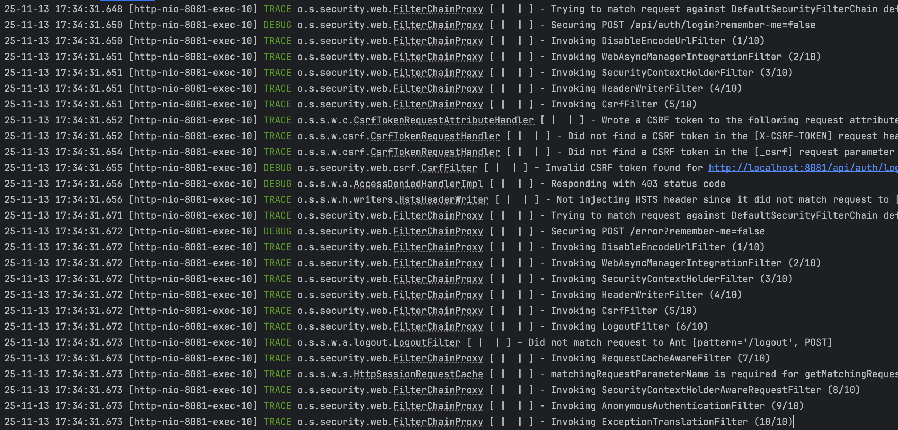

## 세션 관리 고도화

- [ ]  동일한 계정으로 동시 로그인할 수 없도록 설정하세요.
    - `sessionConcurrency` 설정을 활용하세요.

  ```java
   http
  .sessionManagement(management ->management
  .

sessionConcurrency(concurrency ->concurrency
   ...
	 )
	 )
  ```

    - 세션의 동일성을 보장하기 위해 DiscodeitUserDetails의 equals(), hashcode() 메소드를 오버라이딩하세요.

> [공식 문서](https://docs.spring.io/spring-security/reference/servlet/authentication/session-management.html#ns-concurrent-sessions)
<br/>If you are using a custom implementation of UserDetails, ensure you override the equals() and hashCode() methods.
> The
> default SessionRegistry implementation in Spring Security relies on an in-memory Map that uses these methods to
> correctly identify and manage user sessions. Failing to override them may lead to issues where session tracking and
> user
> comparison behave unexpectedly.

- [ ]  권한이 변경된 사용자가 로그인 상태라면 세션을 무효화하세요.

`sessionRegistry`를 활용하세요.

```java

@Bean
public SecurityFilterChain filterChain(
...
  HttpSecurity http,
  SessionRegistry sessionRegistry
) {
	http
	  .sessionManagement(management -> management
		.sessionConcurrency(concurrency -> concurrency
...
.sessionRegistry(sessionRegistry)
)
)
...
}

@Bean
public SessionRegistry sessionRegistry() {...}
```

- `httpSessionEventPublisher`: HttpSession이 만료된 경우 이벤트를 통해 SessionRegistry의 SessionInformation도 자동으로 만료하기 위해 필요한
  Bean입니다.

```java

@Service
public class BasicAuthService implements AuthService {
...
	private final SessionRegistry sessionRegistry;
...
}
```

- [ ]  UserStatus 엔티티 대신 SessionRegistry를 활용해 사용자의 로그인 여부를 판단하도록 리팩토링하세요.

    - UserStatus 엔티티와 관련된 코드는 모두 삭제하세요.
    - (로그아웃처럼) `HttpSession` 만료 시 `SessionRegistry`의 `SessionInformation`도 자동으로 만료 처리할 수 있도록 `HttpSessionEventPublisher`
      를 Bean으로
      등록합니다.

  ```java

@Bean
public HttpSessionEventPublisher httpSessionEventPublisher() {
	return new HttpSessionEventPublisher();
}
  ```

---

## 로그인 고도화 - RememberMe

- [ ]  로그인 요청 파라미터(remember-me)가 true인 경우 세션이 무효화되어도 자동으로 다시 로그인되도록 하세요.
    - 로그인 화면에서 로그인 유지 체크 후 로그인하면 remember-me 파라미터가 true로 설정되어 요청합니다.
      

- `remeberMe` 설정을 활용하세요.

```java
http
  .rememberMe(...)
```

- 로그인 상태에서 `JESSIONID` 쿠키를 삭제 후 새로고침했을 때 인증 상태가 유지 되는지 확인해보세요.
  

---

## 권한 적용 고도화

- [ ] SpEL을 활용해 Method Security 기반 리소스 보호 정책을 강화해보세요.
    - 사용자 정보 수정, 삭제는 본인만 할 수 있습니다.
    - 메시지 수정, 삭제는 해당 메시지를 작성한 사람만 할 수 있습니다.

---

## 첨부

